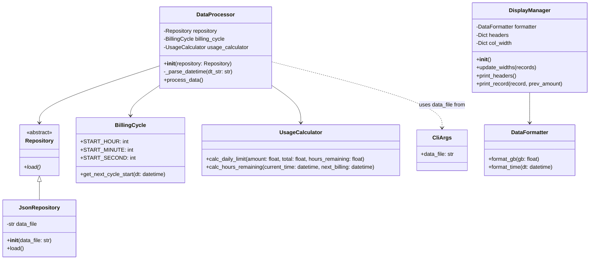

```mermaid
classDiagram
    class DataProcessor {
        -Repository repository
        -BillingCycle billing_cycle
        -UsageCalculator usage_calculator
        +__init__(repository: Repository)
        -_parse_datetime(dt_str: str)
        +process_data()
    }

    class Repository {
        <<abstract>>
        +load()*
    }

    class JsonRepository {
        -str data_file
        +__init__(data_file: str)
        +load()
    }

    class BillingCycle {
        +START_HOUR: int
        +START_MINUTE: int
        +START_SECOND: int
        +get_next_cycle_start(dt: datetime)
    }

    class UsageCalculator {
        +calc_daily_limit(amount: float, total: float, hours_remaining: float)
        +calc_hours_remaining(current_time: datetime, next_billing: datetime)
    }

    class DisplayManager {
        -DataFormatter formatter
        -Dict headers
        -Dict col_width
        +__init__()
        +update_widths(records)
        +print_headers()
        +print_record(record, prev_amount)
    }

    class DataFormatter {
        +format_gb(gb: float)
        +format_time(dt: datetime)
    }

    class CliArgs {
        +data_file: str
    }

    Repository <|-- JsonRepository
    DataProcessor --> Repository
    DataProcessor --> BillingCycle
    DataProcessor --> UsageCalculator
    DisplayManager --> DataFormatter
    DataProcessor ..> CliArgs: uses data_file from
```
