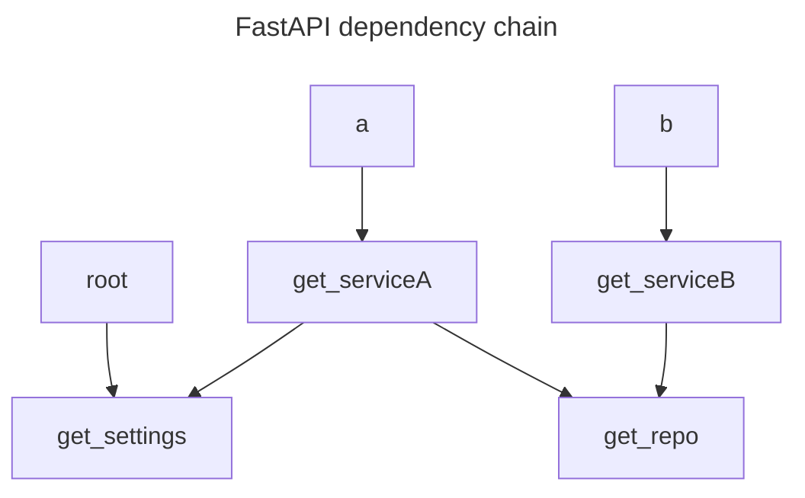

# FastAPI Dependency Injection Visualizer

This is a simple tool to visualize the dependency injection tree of a FastAPI application.
It works by inspecting the FastAPI application and generating a graph of the dependencies from walking the dependency injection tree starting from the application's endpoints.

It automatically detects the endpoints and the dependencies of the application and generates a graph of the dependencies.

## Usage

Install the package in the environment where your FastAPI application is installed.
```bash
pip install fastapi-di-viz
```

Then run the following command to generate the graph:
```bash
fastapi-di-viz your_app.main:app
```

A sample graph for the application in [fastapi_di_viz/sample](./fastapi_di_viz/sample/) looks like this:



The tool supports graphs in the following formats:

- Graphviz DOT format
- Mermaid flowchart format
