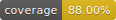

.. libpulse documentation master file.

libpulse |version|
==================

.. include:: ../../README.rst

.. toctree::
   :hidden:
   :maxdepth: 2
   :caption: Table of Contents

   ReadMe <self>
   api
   development
   history
   Repository <https://gitlab.com/xdegaye/libpulse>
