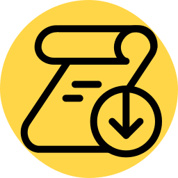

# Cloudflare Web Application Firewall downloader


[](https://badge.fury.io/py/waf-downloader)
[](https://pypi.org/project/waf-downloader/)
[](LICENSE)

A library, CLI, and docker image that downloads Cloudflare WAF logs for a specified zone and time range.



## Schema

See [src/waf_logs/resources/db/](./src/waf_logs/resources/db) for a list of schemas that are auto-applied at start. This can be disabled by passing `--ensure_schema False`.

## Quickstart

The project is published at <https://pypi.org/project/waf-downloader/>.

Install it via:

```shell
pip install waf-downloader

# or alternatively, directly from git
pip install "git+https://github.com/MihaiBojin/waf-downloader@main"
```

Or with Docker:

```shell
docker pull docker.io/mihaibojin/waf-downloader:latest
```

The list of published images can be found at:
<https://github.com/MihaiBojin/waf-downloader/pkgs/container/waf-downloader>

and

<https://hub.docker.com/repository/docker/mihaibojin/waf-downloader/tags>

## Or with Helm

See [charts/waf-downloader/README.md](./charts/waf-downloader/README.md) for more details.

## Development

### Build and run with Docker

Define secrets in an `.env` file (do not quote values):

```properties
CLOUDFLARE_API_TOKEN=...
DB_CONN_STR=...
```

The Cloudflare token is required (see [required permissions](https://developers.cloudflare.com/analytics/graphql-api/getting-started/authentication/api-token-auth/)),
but the connection string is optional. If skipped, it will result in logs being printed to stdout.

IMPORTANT: This project uses [taskfile.dev](https://taskfile.dev/installation/),
which you will need to install for running the following commands:

```shell
# Build
task docker-build

# Load all logs in zone, starting 5 minutes prior
task docker-run -- --zone_id zoneid1 --start_minutes_ago 5

# And alternatively, only output the logs
task docker-run -- --zone_id zoneid1 --start_minutes_ago 5 2>/dev/null

# Do not specify a start time, relying on a starting timestamp stored in the database
# If a timestamp is not found in the database, or specified with --start_minutes_ago, the downloader will start 5 minutes prior
# This functionality makes it easy to run waf-downloader as a cron job
# NOTE: specifying --start_minutes_ago will always override the timestamp stored in the database, causing potential gaps in the data
task docker-run -- --zone_id zoneid1

# Do not exit and keep downloading new logs forever
# These will be recent up to the last minute
task docker-run -- --zone_id zoneid1 --follow

# Multiple zones can be specified via a comma-separated string
task docker-run -- --zone_id zoneid1,zoneid2,zoneid3,etc

# Or by repeating the flag
task docker-run -- --zone_id zoneid1 --zone_id zoneid2 --zone_id zoneid3 ...
```

## Publishing to PyPI

### GitHub-based version publishing

The simplest way to publish a new version (if you have committer rights) is to tag a commit and push it to the repo:

```shell
# At a certain commit, ideally after merging a PR to main
git tag v0.1.x
git push origin v0.1.x
```

A [GitHub Action](https://github.com/MihaiBojin/waf-downloader/actions) will run, build the library and publish it to the PyPI repositories.

### Manual publish

These steps can also be performed locally. For these commands to work, you will need to export two environment variables (or define them in `.env`):

```shell
export TESTPYPI_PASSWORD=... # token for https://test.pypi.org/legacy/
export PYPI_PASSWORD=... # token for https://upload.pypi.org/legacy/
```

First, publish to the test repo and inspect the package:

```shell
task publish-test
```

If correct, distribute the wheel to the PyPI index:

```shell
task publish
```

Verify the distributed code

```shell
task publish-verify
```

## Cloudflare WAF documentation

- <https://developers.cloudflare.com/analytics/graphql-api/tutorials/querying-firewall-events>
- <https://developers.cloudflare.com/analytics/graphql-api/tutorials/export-graphql-to-csv/>
